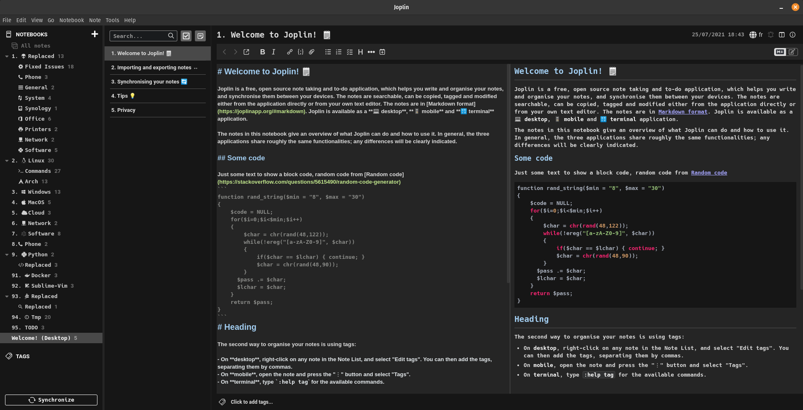

# Joplin-Dark-Theme

This is a theme I made for Joplin that has been tested and developped on Joplin version 2.1.6 to 2.2.1. It uses the Hack Nerd font to have access to a lot of icons that can get integrated directly into the text (All icons : https://www.nerdfonts.com/cheat-sheet)

The theme has been made for my use case so not all markdown syntax is overriden by the theme as I don't use them (but Joplin default style will apply).

## Installation

* Install the Hack Nerd Font from here https://www.nerdfonts.com/font-downloads (You can change the font used if you want by modifying the userchrome.css and userstyle.css)
* Download and place both userchrome.css and userstyle.css in your Joplin directory
  *  Linux: /home/USERNAME/.config/joplin-desktop/
  *  Windows: C:\Users\USERNAME\.config\joplin-desktop
  *  MacOS: Should be similar
* Set Joplin to use the "Dark" theme in Options > Appearance > Theme
* Restart Joplin
